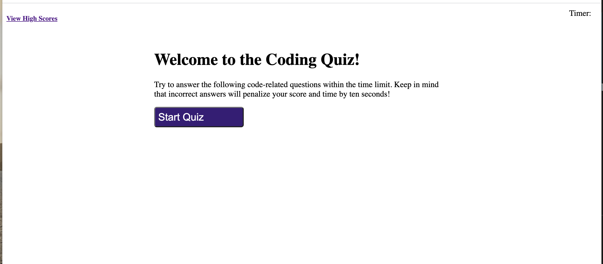

# coding-quiz

## Description 
Ready to test your javascript knowledge? Participate in this coding quiz to put your javascript skills to the test and compare with fellow coders on our high score page.  
## Installation
1. Open your machine's terminal and navigate to the directory you want to save the application in.
2. Run 'git clone https://github.com/angeeg/codingquiz.git' in the command line.
3. Open the cloned repo in your code editor. 
4. Right click in the 'index.html' file and select 'Open in Default Browser' to open the application in your web browser.
## Usage 
View the live website [here](https://angeeg.github.io/password-generator/). Follow the prompts to generate your unique password.

Compare your javascript knowledge with fellow coders in this quick and easy javascript coding quiz. 

## Credit 
This code was refactored by <a href="https://github.com/angeeg">angeeg</a>.

## Questions
If you have any questions or run into any issues with the website please contact <a href="https://github.com/angeeg">angeeg</a>.